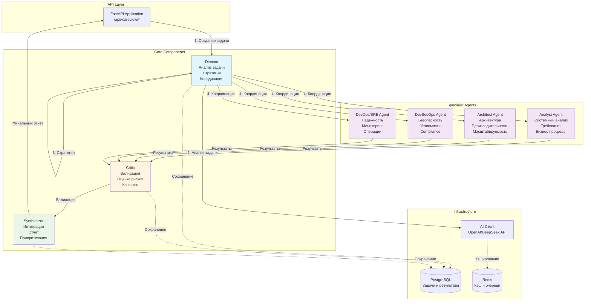
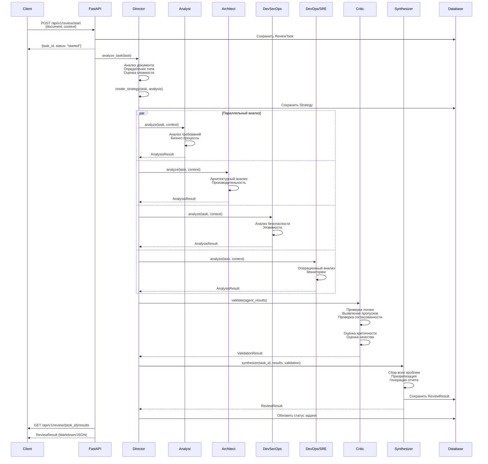
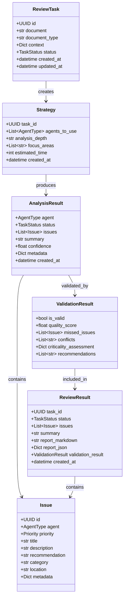
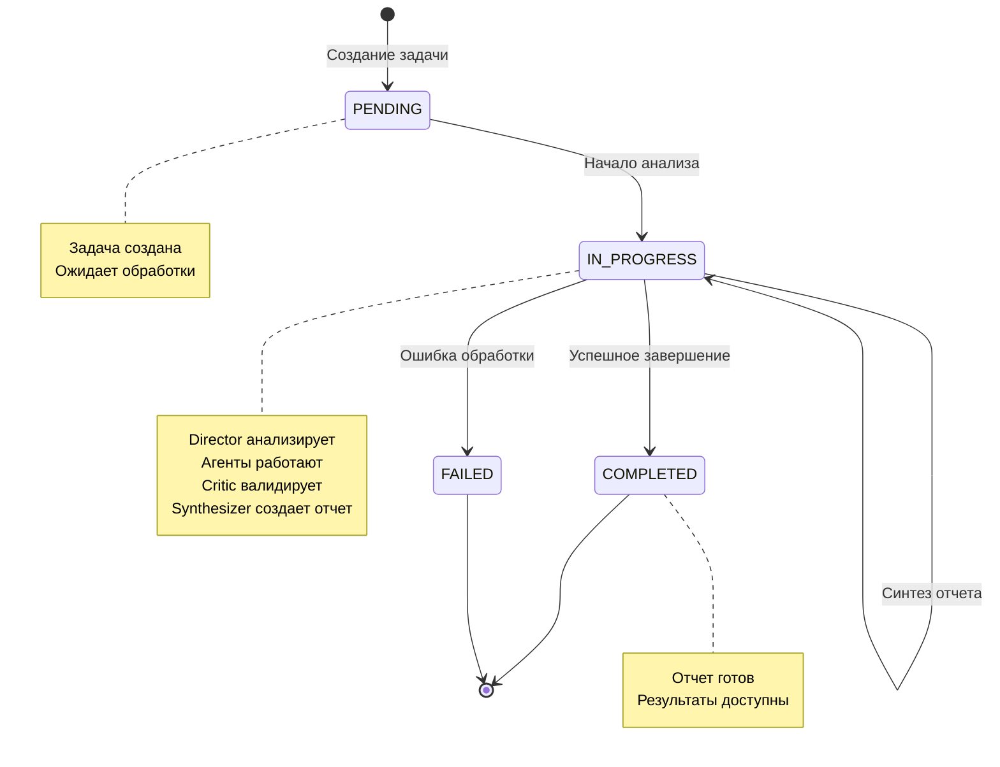
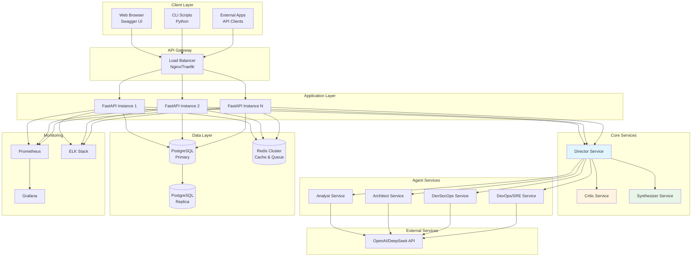

# 🏗️ Архитектура DocReview AI

## Обзор системы

DocReview AI - это многоагентная система для анализа технической документации, состоящая из 7 компонентов: 3 ядра (Director, Critic, Synthesizer) и 4 специалиста (Analyst, Architect, DevSecOps, DevOps/SRE).

## Архитектурная диаграмма компонентов

## Sequence диаграмма: Workflow анализа

## Диаграмма классов данных

## Диаграмма состояния задачи

## Диаграмма развертывания

## Компоненты и их взаимодействие

### Ядро системы

1. **Director (Директор)**
   - Анализирует входящую задачу
   - Создает стратегию анализа
   - Координирует работу агентов
   - Управляет процессом

2. **Critic (Критик)**
   - Валидирует результаты агентов
   - Выявляет пропущенные проблемы
   - Проверяет согласованность
   - Оценивает критичность и качество

3. **Synthesizer (Синтезатор)**
   - Интегрирует результаты всех агентов
   - Приоритизирует проблемы
   - Генерирует финальный отчет
   - Экспортирует в различные форматы

### Агенты-специалисты

1. **Analyst Agent** - Системный аналитик
2. **Architect Agent** - Архитектор
3. **DevSecOps Agent** - Специалист по безопасности
4. **DevOps/SRE Agent** - Специалист по операциям

## Технологический стек

- **Backend**: Python 3.11+, FastAPI
- **Database**: PostgreSQL, Redis
- **AI/ML**: OpenAI API (GPT-4), DeepSeek API
- **Infrastructure**: Docker, Kubernetes
- **Monitoring**: Prometheus, Grafana, ELK Stack

## Принципы архитектуры

1. **Многоуровневая верификация** - Проверка с 4-х сторон + валидация
2. **Параллельная обработка** - Агенты работают одновременно
3. **API-First** - Все компоненты доступны через REST API
4. **Масштабируемость** - Горизонтальное масштабирование
5. **Надежность** - Обработка ошибок, retry механизмы

