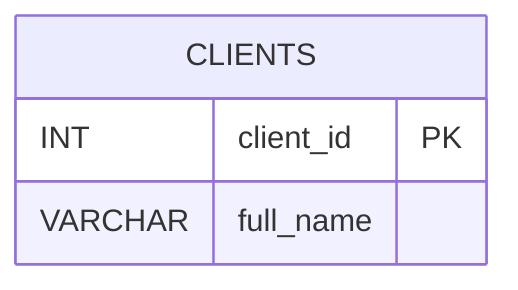

# 📖 Как использовать Swagger UI для анализа документации

> ⚠️ **ВАЖНО:** Если получаете ошибку 422 "Invalid control character", используйте готовый скрипт вместо ручного заполнения:
> ```bash
> python scripts/cli/send_review_request.py
> ```
> Это проще и без ошибок! См. [EASY_WAY.md](EASY_WAY.md)

## Шаг 1: Откройте Swagger UI

Перейдите на: **http://localhost:8000/docs**

Вы увидите список всех API endpoints.

---

## Шаг 2: Найдите нужный endpoint

Найдите и откройте:
```
POST /api/v1/review/start
```

Нажмите на него, чтобы развернуть.

---

## Шаг 3: Нажмите "Try it out"

Нажмите кнопку **"Try it out"** (справа вверху)

---

## Шаг 4: Заполните запрос - ПОДРОБНАЯ ИНСТРУКЦИЯ

После нажатия "Try it out" вы увидите форму с тремя полями. Вот как их заполнить:

---

### Поле 1: `document` (обязательное)

**Это самое важное поле!** Сюда нужно вставить содержимое вашего файла из `C:\review`.

> 💡 **ВАЖНО:** Файлы автоматически читаются из `C:\review`. Используйте скрипт для получения содержимого!

#### Способ А: Используйте скрипт (РЕКОМЕНДУЕТСЯ) ✅

**Это самый простой способ!** Скрипт автоматически прочитает все файлы из `C:\review` и покажет их содержимое.

1. **Откройте терминал** (PowerShell или CMD)
2. **Запустите команду:**
   ```bash
   python scripts/cli/show_file_content_json.py
   ```
3. **Скрипт автоматически:**
   - Найдет все `.md` и `.txt` файлы в `C:\review`
   - Прочитает их содержимое
   - Объединит все файлы в один текст
   - Покажет готовый текст для копирования

4. **Вы увидите что-то вроде:**
   ```
   ======================================================================
   Содержимое файлов из C:\review
   ======================================================================
   
   ✅ Загружен: my_docs.md
   ----------------------------------------------------------------------
   
   📄 СОДЕРЖИМОЕ ДЛЯ КОПИРОВАНИЯ:
   
   ======================================================================
   # my_docs.md
   
   ---
   
   ### **Документация (Версия 1.0)**
   
   [весь текст вашей документации]
   
   ======================================================================
   ```

5. **Скопируйте текст:**
   - Выделите весь текст между двумя строками `======` (включая заголовки и весь текст документации)
   - Нажмите Ctrl+C для копирования

6. **В Swagger UI:**
   - Найдите большое текстовое поле `document`
   - Нажмите в него мышкой
   - Вставьте скопированный текст (Ctrl+V)

**Готово!** Поле `document` заполнено автоматически из файлов в `C:\review`.

**Важно:** Вставляйте весь текст, включая заголовки типа `# my_docs.md`

#### Способ Б: Вручную из файла

1. Откройте файл из `C:\review` в блокноте (например, `C:\review\my_docs.md`)
2. Выделите весь текст (Ctrl+A)
3. Скопируйте (Ctrl+C)
4. В Swagger UI в поле `document` вставьте текст (Ctrl+V)

**Пример того, что должно быть в поле `document`:**
```
# my_docs.md

---

### **Документация (Версия 1.0)**



**Описание изменений:**
1. **Цель:** Добавить возможность хранения данных...
```

---

### Поле 2: `document_type` (обязательное)

Это простое текстовое поле. Введите туда:

```
markdown
```

**Именно так:** просто слово `markdown` (без кавычек, без пробелов)

**Другие возможные значения:**
- `markdown` (рекомендуется для .md файлов)
- `text` (для .txt файлов)
- `json` (для JSON документации)

---

### Поле 3: `context` (необязательное)

Это поле для дополнительной информации о проекте. Можно заполнить или оставить пустым.

#### Вариант А: Оставить пустым

Просто введите:
```
{}
```

#### Вариант Б: Заполнить информацией о проекте

Введите JSON объект:
```json
{
  "project_type": "microservices"
}
```

**Или более подробно:**
```json
{
  "project_type": "microservices",
  "requirements": ["security", "scalability"],
  "industry": "finance"
}
```

**Возможные значения `project_type`:**
- `microservices`
- `monolith`
- `serverless`
- `payment_system`
- или любой другой тип вашего проекта

---

## 📋 Пример заполнения всей формы

После заполнения ваша форма должна выглядеть примерно так:

```json
{
  "document": "# my_docs.md\n\n---\n\n### **Документация (Версия 1.0)**\n\n[весь текст вашей документации здесь]",
  "document_type": "markdown",
  "context": {
    "project_type": "microservices"
  }
}
```

**Визуально в Swagger UI:**

```
┌─────────────────────────────────────────────────────────┐
│ Request body                                            │
├─────────────────────────────────────────────────────────┤
│ document:                                               │
│ ┌─────────────────────────────────────────────────────┐ │
│ │ # my_docs.md                                        │ │
│ │                                                      │ │
│ │ ---                                                  │ │
│ │                                                      │ │
│ │ ### **Документация (Версия 1.0)**                   │ │
│ │                                                      │ │
│ │ [ваш текст]                                          │ │
│ └─────────────────────────────────────────────────────┘ │
│                                                          │
│ document_type:                                           │
│ ┌──────────┐                                            │
│ │ markdown │                                            │
│ └──────────┘                                            │
│                                                          │
│ context:                                                 │
│ ┌──────────────────────┐                               │
│ │ {                    │                               │
│ │   "project_type":    │                               │
│ │   "microservices"    │                               │
│ │ }                    │                               │
│ └──────────────────────┘                               │
└─────────────────────────────────────────────────────────┘
```

---

## ✅ Чеклист перед нажатием "Execute"

Проверьте, что:

- [ ] В поле `document` вставлен весь текст из файла (можно проверить, что текст начинается с `#` или другого заголовка)
- [ ] В поле `document_type` написано `markdown` (без кавычек)
- [ ] В поле `context` либо `{}`, либо JSON объект с информацией о проекте
- [ ] Все поля заполнены (кроме `context`, которое можно оставить пустым)

---

## 🎯 Быстрая шпаргалка

1. **Запустите:** `python show_file_content.py`
2. **Скопируйте** весь текст между `======`
3. **В Swagger UI** в поле `document` → вставьте текст
4. **В поле `document_type`** → введите: `markdown`
5. **В поле `context`** → введите: `{}`
6. **Нажмите "Execute"**

Готово! 🎉

---

## Шаг 5: Нажмите "Execute"

Нажмите кнопку **"Execute"** (синяя кнопка внизу)

---

## Шаг 6: Получите task_id

В ответе вы увидите:
```json
{
  "task_id": "550e8400-e29b-41d4-a716-446655440000",
  "status": "started",
  "estimated_time": 180
}
```

**Скопируйте `task_id`** - он понадобится для получения результатов!

---

## Шаг 7: Проверьте статус

1. Найдите endpoint: **GET /api/v1/review/{task_id}/status**
2. Нажмите **"Try it out"**
3. Вставьте ваш `task_id` в поле `task_id`
4. Нажмите **"Execute"**

Повторяйте этот шаг каждые 10-15 секунд, пока `has_result` не станет `true`

---

## Шаг 8: Получите результаты

1. Найдите endpoint: **GET /api/v1/review/{task_id}/results**
2. Нажмите **"Try it out"**
3. Вставьте ваш `task_id` в поле `task_id`
4. Нажмите **"Execute"**

Вы увидите:
- Количество найденных проблем
- Оценку качества
- Резюме

---

## Шаг 9: Получите полный отчет

1. Найдите endpoint: **GET /api/v1/review/{task_id}/report**
2. Нажмите **"Try it out"**
3. Вставьте ваш `task_id` в поле `task_id`
4. В поле `format` выберите: `markdown`
5. Нажмите **"Execute"**

Скопируйте содержимое поля `report` и сохраните в файл `C:\review\review_report.md`

---

## Пример заполнения запроса

```json
{
  "document": "# Ваша документация здесь\n\n## Раздел 1\n\nТекст...",
  "document_type": "markdown",
  "context": {
    "project_type": "microservices"
  }
}
```

---

## Полезный скрипт

Запустите `python scripts/cli/show_file_content_json.py` чтобы быстро получить содержимое файла для копирования в Swagger UI.

