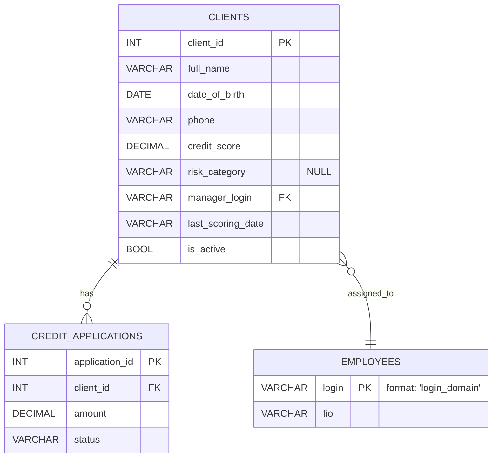

---

### **Документация (Версия 1.0 )**

**Описание изменений:**
1.  **Цель:** Добавить возможность хранения данных скоринга и внутренней аналитики.
2.  **Новые поля в таблице `CLIENTS`:**
    *   `credit_score` (DECIMAL) — рейтинг клиента, рассчитанный моделью.
    *   `risk_category` (VARCHAR) — категория риска ("низкий", "средний", "высокий"). **Может быть NULL.**
    *   `last_scoring_date` (VARCHAR) — дата последнего расчета скоринга.
    *   `manager_login` (VARCHAR) — логин ответственного менеджера. Ссылается на `EMPLOYEES.login`.
    *   `is_active` (BOOL) — флаг активности клиента для кредитования.
3.  **Бизнес-правила:**
    *   Скоринг обновляется еженедельно.
    *   Менеджер может быть не назначен (поле `manager_login` может быть `NULL`).
    *   Поле `risk_category` вычисляется на основе `credit_score`.

---