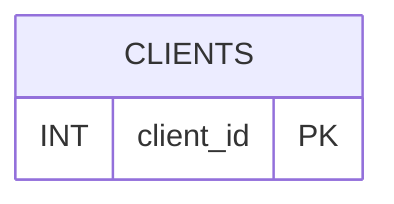

# 📝 Как заполнить поле "document" в Swagger UI

## 🎯 Главное правило

**Файлы автоматически читаются из `C:\review`!** Вам не нужно вручную открывать файлы.

---

## ✅ Самый простой способ (3 шага)

### Шаг 1: Запустите скрипт

Откройте терминал и выполните:

```bash
python scripts/cli/show_file_content_json.py
```

### Шаг 2: Скопируйте текст

Скрипт покажет содержимое всех файлов из `C:\review`. 

**Вы увидите:**
```
======================================================================
Содержимое файлов из C:\review
======================================================================

✅ Загружен: my_docs.md
----------------------------------------------------------------------

📄 СОДЕРЖИМОЕ ДЛЯ КОПИРОВАНИЯ:

======================================================================
# my_docs.md

---

### **Документация (Версия 1.0)**

[весь текст вашей документации здесь]

======================================================================
```

**Скопируйте весь текст** между двумя строками `======` (включая заголовки и весь текст).

### Шаг 3: Вставьте в Swagger UI

1. Откройте http://localhost:8000/docs
2. Найдите `POST /api/v1/review/start`
3. Нажмите "Try it out"
4. В поле `document` вставьте скопированный текст (Ctrl+V)

**Готово!** ✅

---

## 📋 Что именно копировать?

Копируйте **весь текст** от первой строки `======` до последней строки `======`, включая:

- Заголовки файлов (например, `# my_docs.md`)
- Разделители (`---`)
- Весь текст документации
- Все символы и форматирование

**Пример того, что нужно скопировать:**
```
======================================================================
# my_docs.md

---

### **Документация (Версия 1.0)**



**Описание изменений:**
1. **Цель:** Добавить возможность...
======================================================================
```

---

## 🔍 Проверка правильности

После вставки в поле `document` проверьте:

- ✅ Текст начинается с заголовка (например, `# my_docs.md`)
- ✅ Текст содержит вашу документацию
- ✅ Текст заканчивается содержимым документации
- ✅ В тексте есть все разделы из вашего файла

---

## ❓ Частые вопросы

### Вопрос: Нужно ли открывать файл вручную?

**Ответ:** НЕТ! Скрипт `show_file_content_json.py` автоматически читает все файлы из `C:\review`.

### Вопрос: Что если в `C:\review` несколько файлов?

**Ответ:** Скрипт автоматически объединит все файлы в один текст. Просто скопируйте весь результат.

### Вопрос: Можно ли скопировать только часть текста?

**Ответ:** Лучше скопировать весь текст - так система проанализирует всю документацию.

### Вопрос: Что если файл не в формате .md или .txt?

**Ответ:** Скрипт читает только `.md` и `.txt` файлы. Конвертируйте файл в один из этих форматов.

---

## 🚀 Быстрая шпаргалка

```
1. python scripts/cli/show_file_content_json.py
2. Скопировать текст между ======
3. Вставить в поле "document" в Swagger UI
```

**Всё!** 🎉

